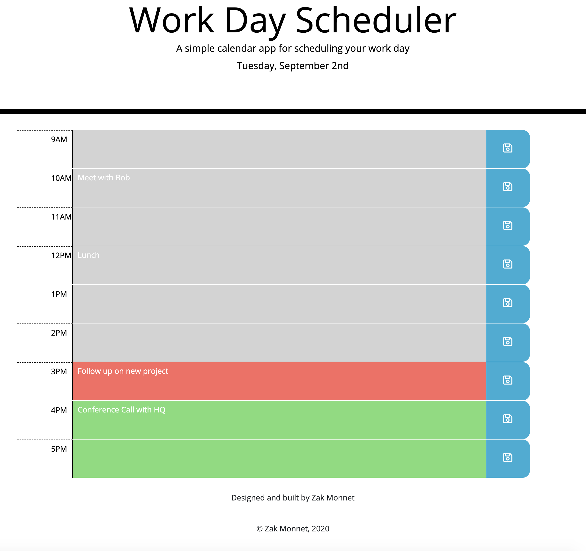

# 05-Work-Day-Scheduler
Homework #5

Preview:

Work Day Scheduler

Application grabs current time when page loads

Current hour is highlighted in red, future hours are highlighted green and past hours are red

User can input/edit tasks to specific hours

When save button for each hour is clicked, tasks for that hour are saved to local storage

When page is revisted, application will get and display saved tasks from local storage

See it in action:
[Click Me](https://outoftune266.github.io/05-Work-Day-Scheduler/)